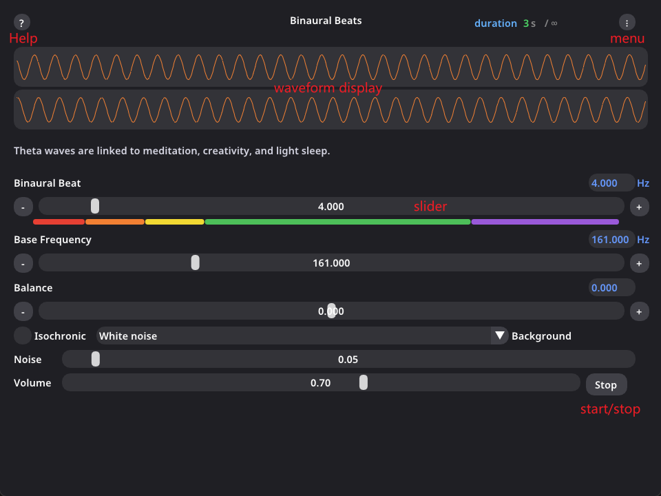

# 双耳节拍 (Binaural Beats)

支持双耳节拍、等时节拍、粉红/白噪声、Gnaural 文件解析，预留 AI 闭环接口。

## 下载

在 [Release](https://github.com/ApexGP/Binaural-Beats-cpp/releases) 发布页面下载打包好的压缩包

## 构建

### 依赖（vcpkg + MinGW toolchain）

```powershell
# 安装 PortAudio + ImGui
vcpkg install portaudio:x64-mingw-static imgui[glfw-binding,opengl3-binding]:x64-mingw-static

# 编译（需配置VCPKG_ROOT）
mkdir build
cd build
cmake .. -G "MinGW Makefiles" -DCMAKE_BUILD_TYPE=Release
make -j4
```

- 缺少 `portaudio` 时，程序会生成 `output.wav`（10 秒）用于验证
- 缺少 `imgui` 时，GUI 目标不构建
- `vcpkg` 安装教程点击[这里](https://learn.microsoft.com/zh-cn/vcpkg/get_started/get-started?pivots=shell-bash)

## 运行

### CLI

（需 PortAudio，缺少时生成 `output.wav`）

```powershell
.\build\BinauralBeats.exe [options]
```

常用选项：

- `--duration N` 播放时长(秒)
- `--beatFreq F` 节拍频率
- `--baseFreq F` 基频
- `--noise pink|white` 噪声
- `--isochronic` 等时节拍
- `--volume F` 音量
- `--file PATH` 加载 .gnaural/.txt 文件

使用 `--help` 查看完整用法

播放控制：**Enter** 暂停/恢复，**Q** 退出

### GUI

（需 PortAudio + imgui）

```powershell
.\build\BinauralBeatsGui.exe
```



GUI 功能

- 节拍频率 (0.5–40 Hz)、基频、平衡、音量
- 波段颜色标识（Delta/Theta/Alpha/Beta/Gamma）
- 频率输入支持
- 等时节拍 (Isochronic) 开关
- 背景噪声：无 / 粉红 / 白噪声，可调音量
- 实时波形显示
- 加载 Gnaural 文件（右上角菜单 ⋮ → Load Gnaural...）：支持 `.txt` 旧格式与 `.gnaural` XML

### Gnaural 预设文件

点击[这里](https://github.com/user-attachments/files/25322281/preset.zip)下载，解压后把 `preset/` 文件夹放到任意目录即可使用

## TODO

- [x] 核心合成、PortAudio 播放
- [x] 等时节拍、粉红噪声、Gnaural 解析
- [x] StubPredictor、参数控制层、无锁队列
- [ ] 集成 ONNX/LibTorch，对接 CNN-LSTM 闭环
